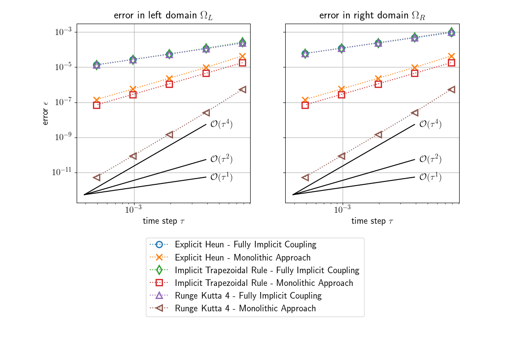
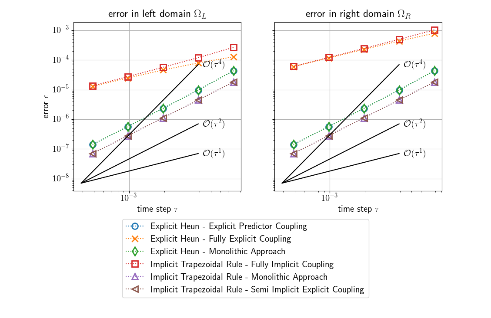
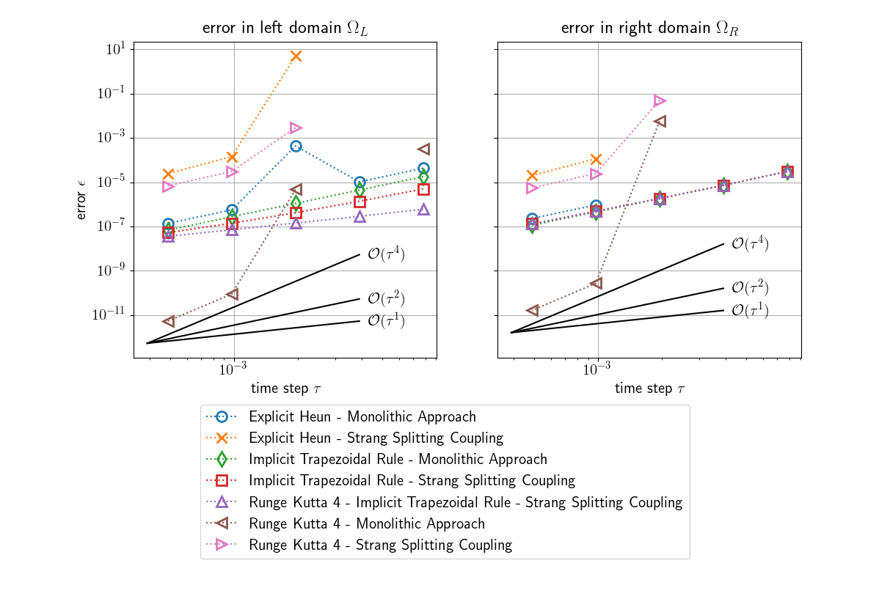
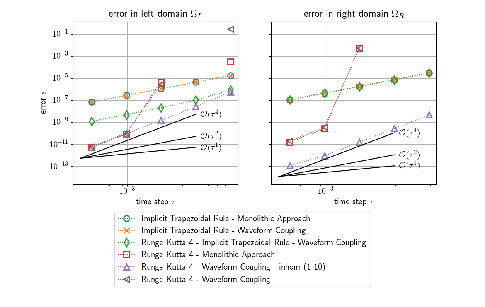

# Running the code

Run the code by typing ```python main.py```. You need numpy and scipy for executing the code. Output folders with experimental results are created. The folders are named in the following way: ```seriesX_SHORTNAME_DATETIME```. See below for details on the different experimental series.

You can plot the results by running ```python postproc.py <foldername>```. You need matplotlib for plotting.

# Convergence Study

This code can be used to perform convergence studies in a partitioned multi-physics multi-scale setup. As a benchmark scenario the 1D heat transport equations is solved. For details see [1]. The convergence studies performed by this code are identical to the ones described in [1]. 

## Parameter set from [1]

If you clone this repository, you can directly perform the experiments described in [1] with the respective parameters:

* maximum simulation time **T** = 1
* largest timestep size **tau_0** = 1/4
* considered timestep sizes **tau_i** = [1/4, 1/8, 1/16, ..., 1/1024, 1/2048]
* coarse mesh resolution **h** = 0.2
* fine mesh resolution **h/4** = 0.05

## Parameter set with lower runtime

For a lower runtime, you can also use a modified parameter set:

* maximum simulation time **T** = 1/32
* largest timestep **tau_0** = 1/128
* considered timestep sizes **tau_i** = [1/128, 1/256, 1/512, 1/1024, 1/2048]

The plots below are created from the modified parameter set.

## Experimental Series 1

Order degradation to first order if classical implicit coupling is used with higher order schemes a regular domain



## Experimental Series 2

Second order if customized coupling schemes are used with second order schemes a regular domain



## Experimental Series 3

Second order if Strang splitting coupling is used with higher order schemes on a non-regular domain



## Experimental Series 4

High order if waveform relaxation coupling is used with higher order schemes on a non-regular domain



# Reference

If you want to refer to this code, please use the following reference:

[1] Rüth, B., Uekermann, B., Mehl, M., & Bungartz, H.-J. (2018). Time Stepping Algorithms for Partitioned Multi-Scale Multi-Physics. Proceedings of ECCM VI / ECFD VII, (June).
